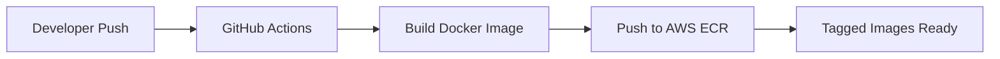

# Chores Tracker Integration Documentation

This document describes the relationship between the chores-tracker application source code and its Kubernetes deployment configuration.

## Overview

The Chores Tracker application follows a GitOps deployment model with clear separation between:
- **Application Development**: [github.com/arigsela/chores-tracker](https://github.com/arigsela/chores-tracker)
- **Deployment Configuration**: [github.com/arigsela/kubernetes](https://github.com/arigsela/kubernetes)

## Application Architecture

### Technology Stack
- **Backend Framework**: FastAPI (Python 3.11)
- **Database**: MySQL 5.7 with SQLAlchemy 2.0 ORM
- **Frontend**: Server-side rendered with Jinja2 + HTMX
- **Authentication**: JWT tokens with role-based access (parent/child)
- **Container Runtime**: Docker with multi-stage builds

### Key Features
- Household chore management for families
- Parent accounts create/manage chores
- Child accounts complete assigned chores
- Reward system with fixed or range-based amounts
- Recurring chores with cooldown periods
- Real-time UI updates via HTMX

## Version Status

| Component | Current Version | Latest Available | Status |
|-----------|----------------|------------------|---------|
| Source Code | v2.0.0 | v2.0.0 | ✅ Up to date |
| Kubernetes Deployment | v0.9.9 | v2.0.0 | ⚠️ Update needed |
| ECR Image | Multiple tags | v2.0.0 | ✅ Available |

## Deployment Pipeline

### 1. Source Code to Container Image



**Trigger Events**:
- Push to `main` branch
- GitHub Release publication
- Manual workflow dispatch

**Image Tags Created**:
- Semantic versions: `v2.0.0`, `v2.0`, `v2`
- Latest: `latest` (for main branch)
- SHA: `sha-abc1234`
- Timestamp: `build-20250627-123456`
- Branch name: `main`

### 2. Container Registry

**AWS ECR Repository**: `852893458518.dkr.ecr.us-east-2.amazonaws.com/chores-tracker`

**Access Configuration**:
- ECR credentials synced to Kubernetes via `ecr-credentials-sync`
- Image pull secret: `ecr-registry`

### 3. Kubernetes Deployment

**Location**: `/base-apps/chores-tracker/`

**Key Files**:
```
base-apps/
├── chores-tracker.yaml      # ArgoCD Application
└── chores-tracker/
    ├── deployments.yaml      # Main deployment (image reference here)
    ├── services.yaml         # ClusterIP service
    ├── ingress.yaml          # Traefik IngressRoute
    ├── configmaps.yaml       # App configuration
    ├── external-secrets.yaml # Vault secrets
    └── crossplane/           # Database provisioning
```

### 4. Configuration Management

#### Environment Variables (ConfigMap)
```yaml
ENVIRONMENT: "production"
DEBUG: "False"
BACKEND_CORS_ORIGINS: "https://chores.arigsela.com"
```

#### Secrets (External Secrets from Vault)
```yaml
DATABASE_URL: MySQL connection string
SECRET_KEY: JWT signing key
DB_PASSWORD: Database password
```

**Refresh Interval**: 1 hour

### 5. Database Architecture

Managed via Crossplane CRDs:
- **Database**: `chores-db`
- **User**: `chores-user` (with full privileges)
- **Provider**: MySQL instance (location configured separately)

## Update Process

### To Deploy a New Version

1. **Check Latest Version**
   ```bash
   # Check available tags in ECR
   aws ecr describe-images \
     --repository-name chores-tracker \
     --query 'sort_by(imageDetails,& imagePushedAt)[-10:].imageTags[]' \
     --output table
   ```

2. **Update Deployment**
   ```bash
   # Edit the deployment file
   vi base-apps/chores-tracker/deployments.yaml
   
   # Change line 18 from:
   image: 852893458518.dkr.ecr.us-east-2.amazonaws.com/chores-tracker:v0.9.9
   
   # To:
   image: 852893458518.dkr.ecr.us-east-2.amazonaws.com/chores-tracker:v2.0.0
   ```

3. **Commit and Push**
   ```bash
   git add base-apps/chores-tracker/deployments.yaml
   git commit -m "chore: update chores-tracker to v2.0.0"
   git push origin main
   ```

4. **Monitor Deployment**
   - ArgoCD will automatically detect and sync the change
   - Check application health at https://chores.arigsela.com/api/v1/healthcheck

### Rollback Process

If issues occur, revert the Git commit:
```bash
git revert HEAD
git push origin main
```

ArgoCD will automatically sync back to the previous version.

## Integration Points

### 1. Health Monitoring
- **Endpoint**: `/api/v1/healthcheck`
- **Probe Type**: HTTP GET readiness probe
- **Initial Delay**: 30 seconds
- **Check Interval**: 5 seconds

### 2. Network Access
- **Internal Service**: ClusterIP on port 80 → container port 8000
- **External Access**: Traefik IngressRoute
- **Public URL**: https://chores.arigsela.com
- **CORS Origins**: Configured for frontend domain

### 3. Dependencies
- **Vault**: Secret storage and rotation
- **External Secrets Operator**: Secret synchronization
- **Crossplane**: Database provisioning
- **ECR Credentials Sync**: Registry authentication
- **Traefik**: Ingress and routing

## Development Workflow

### Local Development
1. Clone source repository
2. Use Docker Compose or Tilt for local development
3. Run tests with pytest
4. Create pull request

### Release Process
1. Merge to main branch
2. Create GitHub release with semantic version
3. CI/CD builds and pushes to ECR
4. Update Kubernetes deployment manifest
5. GitOps syncs to cluster

### Monitoring Updates
- **Source Releases**: Watch [github.com/arigsela/chores-tracker/releases](https://github.com/arigsela/chores-tracker/releases)
- **ECR Images**: Monitor AWS ECR for new tags
- **Deployment Status**: Check ArgoCD application health

## Best Practices

### Version Management
1. **Use Semantic Versioning**: Follow semver for releases
2. **Pin Specific Versions**: Avoid using `latest` tag in production
3. **Test Before Deploying**: Verify new versions in staging/test environment
4. **Document Changes**: Update this file when deployment patterns change

### Security
1. **Never Commit Secrets**: Use External Secrets for sensitive data
2. **Rotate Credentials**: Regular rotation via Vault
3. **Update Dependencies**: Keep base images and packages current
4. **Scan Images**: Review security scan results in CI/CD

### Operational Excellence
1. **Monitor Health**: Set up alerts for health check failures
2. **Track Metrics**: Monitor resource usage and response times
3. **Plan Updates**: Schedule updates during low-traffic periods
4. **Maintain Backups**: Ensure database backups are current

## Troubleshooting

### Common Issues

1. **Image Pull Errors**
   - Check ECR credentials are synced
   - Verify image exists with correct tag
   - Check IAM permissions for ECR

2. **Health Check Failures**
   - Review pod logs: `kubectl logs -n chores-tracker <pod-name>`
   - Check database connectivity
   - Verify environment variables

3. **Configuration Issues**
   - Ensure ConfigMap is applied
   - Verify External Secrets are syncing
   - Check Vault connectivity

### Debug Commands

```bash
# Check pod status
kubectl get pods -n chores-tracker

# View pod logs
kubectl logs -n chores-tracker -l app=chores-tracker

# Describe deployment
kubectl describe deployment -n chores-tracker chores-tracker

# Check secrets
kubectl get secrets -n chores-tracker

# Verify configmap
kubectl get configmap -n chores-tracker chores-tracker-config -o yaml
```

## Future Improvements

### Short Term
1. **Automate Version Updates**: Implement image updater for automatic deployments
2. **Add Staging Environment**: Deploy to staging before production
3. **Implement Canary Deployments**: Gradual rollout with Flagger/Argo Rollouts

### Long Term
1. **Multi-Region Deployment**: Expand to multiple AWS regions
2. **Horizontal Scaling**: Add HPA for auto-scaling
3. **Observability**: Integrate with monitoring stack
4. **Backup Automation**: Automated database backup and restore

---

*Last Updated: 2025-06-27*
*Maintained by: Platform Team*