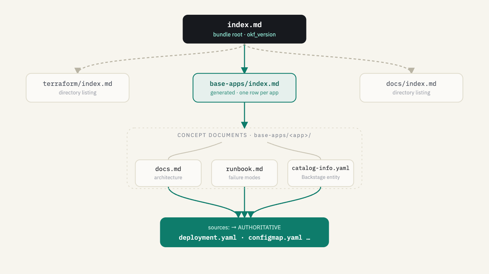

# How our knowledge base is structured

Every document in this repo is an [Open Knowledge Format](https://github.com/GoogleCloudPlatform/knowledge-catalog/blob/main/okf/SPEC.md) (OKF v0.1) concept document — markdown with YAML frontmatter, committed in git, living right beside the manifests it describes. The whole thing is **four layers**: the top is navigation, the bottom is the source of truth.



## The four layers

| # | Layer | Where | Role | What it holds |
|---|-------|-------|------|---------------|
| 01 | **Bundle root** | `index.md` (repo root) | navigation | Carries `okf_version`. System context, topology, cross-cutting concerns. Start here. |
| 02 | **Directory index** | `base-apps/index.md` · `terraform/index.md` · `docs/index.md` | navigation (**generated**) | OKF's reserved directory listing, one row per app. `base-apps/index.md` is generated from each doc's `description:` — never hand-edit it. |
| 03 | **Concept documents** | `base-apps/<app>/docs.md` · `runbook.md` · `catalog-info.yaml` | navigation | `docs.md` (architecture & tribal knowledge), `runbook.md` (symptom → check → fix), `catalog-info.yaml` (structured Backstage entity). Still a summary. |
| 04 | **Sources** | `deployment.yaml`, `configmap.yaml`, `external-secret.yaml`, … | **authoritative** | The actual manifests and Terraform. Everything above is navigation; this is the source of truth. |

## How an agent reads it

A person or agent traverses top-down, resolving one layer to the next until it reaches an authoritative file:

1. **Orient at the root** — read `index.md` for context and topology.
2. **Find the app** — scan the `base-apps/index.md` directory listing for the right row.
3. **Read the docs** — open the app's `docs.md` / `runbook.md` for the summary.
4. **Follow `sources:`** — jump to the listed manifests, the authoritative truth.

> Hand an agent just the knowledge, not the whole repo, with a portable, conformant bundle:
> ```bash
> python3 scripts/gen-okf.py --export <dir>
> ```
> The `timestamp` field is derived from `git log` at export time.

## Rules that keep it honest

- **The index is generated.** Never hand-edit `base-apps/index.md`. Change a doc's `description:` and re-run `python3 scripts/gen-okf.py --repo-root .`.
- **CI gates the drift.** `gen-okf.py --check` runs in `.github/workflows/validate.yaml` and fails the PR if the index is out of sync with doc frontmatter.
- **Sources are authoritative.** Layers 1–3 are navigation. If a summary and its `sources:` disagree, the source wins.
- **Docs live beside code.** Every `docs.md` sits in the app directory it describes, so it moves and reviews with the manifests.

---

*See also: [`index.md`](../index.md) (bundle root) and [`templates/agent-docs/README.md`](../templates/agent-docs/README.md) (authoring contract). An interactive/print version of this diagram is available as `docs/okf-documentation-structure.html`.*
