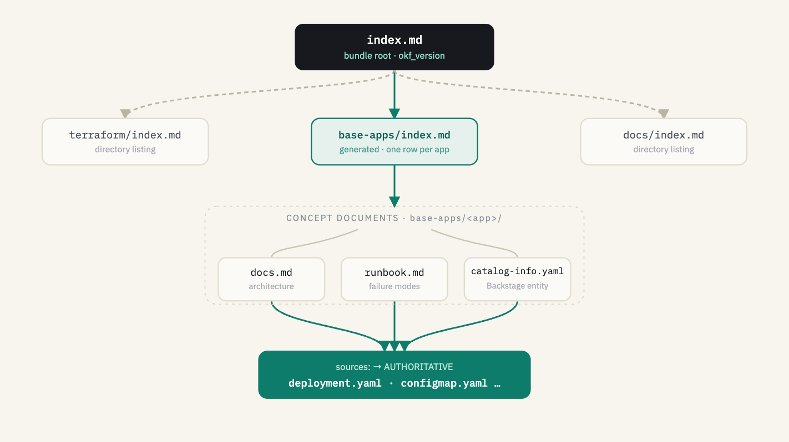

# How our knowledge base is structured

The repo's knowledge base follows the [Open Knowledge Format](https://github.com/GoogleCloudPlatform/open-knowledge-format/blob/main/SPEC.md) (OKF v0.2): the bundle root, the directory indexes and every per-app `docs.md`/`runbook.md` are OKF documents — markdown with YAML frontmatter, committed in git, living right beside the manifests they describe. Not every markdown file is one: most of `docs/` (plans, specs, troubleshooting notes) is plain markdown without frontmatter, listed from `docs/index.md`. The whole thing is **four layers**: the top is navigation, the bottom is the source of truth.



## The four layers

| # | Layer | Where | Role | What it holds |
|---|-------|-------|------|---------------|
| 01 | **Bundle root** | `index.md` (repo root) | navigation | Carries `okf_version`. System context, topology, cross-cutting concerns. Start here. |
| 02 | **Directory index** | `base-apps/index.md` · `terraform/index.md` · `ansible/index.md` · `docs/index.md` | navigation | The directory listings. Only `base-apps/index.md` is **generated** (one row per app, from each doc's `description:`) — never hand-edit it. The other three are hand-written. They carry frontmatter and tables, which OKF §8 doesn't allow in an `index.md`; the export rewrites them. |
| 03 | **Concept documents** | `base-apps/<app>/docs.md` · `runbook.md` · `catalog-info.yaml` | navigation | `docs.md` (architecture & tribal knowledge), `runbook.md` (symptom → check → fix), `catalog-info.yaml` (structured Backstage entity). Still a summary. |
| 04 | **Sources** | `deployment.yaml`, `configmap.yaml`, `external-secret.yaml`, … | **authoritative** | The actual manifests and Terraform. Everything above is navigation; this is the source of truth. |

## How an agent reads it

A person or agent traverses top-down, resolving one layer to the next until it reaches an authoritative file:

1. **Orient at the root** — read `index.md` for context and topology.
2. **Find the app** — scan the `base-apps/index.md` directory listing for the right row.
3. **Read the docs** — open the app's `docs.md` / `runbook.md` for the summary.
4. **Follow `sources:`** — jump to the listed manifests, the authoritative truth.

> Hand an agent just the knowledge, not the whole repo, with a portable, conformant bundle:
> ```bash
> python3 scripts/gen-okf.py --export <dir>
> ```
> The export is strictly OKF v0.2-conformant. It rewrites every `index.md` as a §8 listing (the prose moves to an `overview.md`)
> and adds the trust and lifecycle fields: `generated` from `git log`, `verified` and `stale_after` from `last_reviewed`,
> and `sources` as `{id, resource, last_modified}` entries. See the trust table in
> [`templates/agent-docs/README.md`](../templates/agent-docs/README.md).

## Rules that keep it honest

- **The index is generated.** Never hand-edit `base-apps/index.md`. Change a doc's `description:` and re-run `python3 scripts/gen-okf.py --repo-root .` (on a same-repo PR touching `base-apps/**`, `.github/workflows/okf-autosync.yaml` does this and pushes the result).
- **CI gates the drift.** `gen-okf.py --check` runs in `.github/workflows/validate.yaml` and fails the PR if the index is out of sync with doc frontmatter.
- **Sources are authoritative.** Layers 1–3 are navigation. If a summary and its `sources:` disagree, the source wins.
- **Docs live beside code.** Every `docs.md` sits in the app directory it describes, so it moves and reviews with the manifests.

---

*See also: [`index.md`](../index.md) (bundle root) and [`templates/agent-docs/README.md`](../templates/agent-docs/README.md) (authoring contract).*
